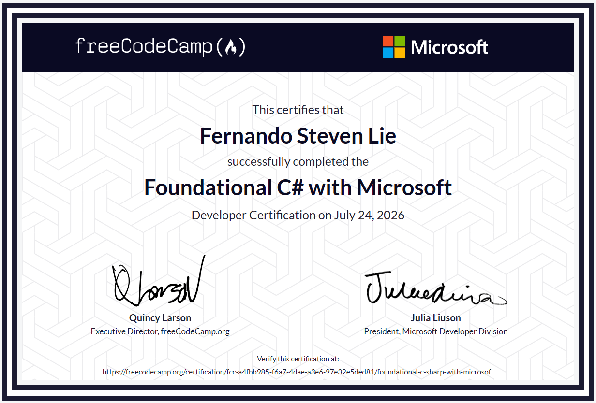

# C# Learning Journey   

This repository contains the projects I completed while learning C# through the Microsoft Learn and freeCodeCamp Foundational C# certification.

I created this repository to keep track of what I've learned and to document my progress as I improve my programming skills.

## What you'll find

- Practice exercises
- Console applications
- Challenge projects
- Course assignments

These projects cover topics such as:

- Variables and data types
- Loops and conditionals
- Methods
- Arrays
- Strings
- File handling
- Basic object-oriented programming
- etc.

## Certification

I completed the **Foundational C# with Microsoft** certification.

Certificate Verification:
https://www.freecodecamp.org/certification/fcc-a4fbb985-f6a7-4dae-a3e6-97e32e5ded81/foundational-c-sharp-with-microsoft

## What's next

My next goal is to build my own C# projects, learn Python, and continue improving my software development skills.
